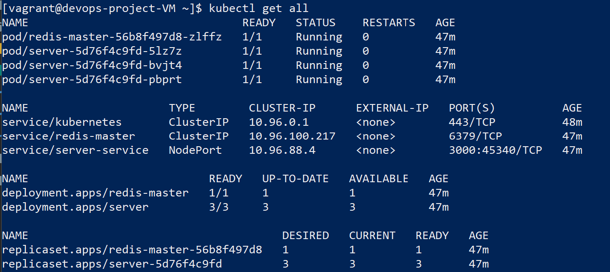

# DevOpsProject_PALCOUX_COLLOT_SOARES
ECE - DevOps project - SOARES Alexandre (Gr4) | COLLOT Paul (Gr2) | PALCOUX Hector (Gr2)

## 1. Work performed

### Web application
The web application is based on the module 4. We pimped it up a little bit by adding the Swagger UI. We also make every mocha tests working (you can try it yourself by launching npm test) and even added others. To launch our application, you must have started the redis server before. the app allows through an API to access user data stored in the redis server.

1. We need to install dependencies : `npm install`
2. we can test our app with the command : `npm test`
3. if there is an error with mocha please use : `npm install mocha`
4. And finally, you can lauch the app with : `npm start`

### CI/CD pipeline
We used travis pipeline for our project as a continuous integration support. The link is below.

We used heroku as a continuous deployement service for our web application. Link is below again.

### Virtual environment using IaC approach 
We use vagrant to configure a centOS virtual machine, along with Ansible for providing the installation of Kuberneties, Docker and starting our Redis database with the web server. Ansible uses a playbook with tasks that install and setup all of this.

### Docker image
DockerFile permits to create an image of our webserver in a docker container, in this container, we need to install all of our dependencies and modules for npm. However the web application needs a redis server to start normally.

The built image is used by kubernetes to download directly from Docker Hub the web server

### Docker Compose
Our Docker Compose is just like the previous Dockerfile but it also pulls a redis image from Docker Hub and links it to our webserver that he builds. Hence, the web server is fully operational

Use the command : `docker-compose up`

### Kubernetes
Kubernetes are installed inside our Virtual Machine. It provides container ochestration, in other words, it controls mutliple instances of our web server using deployments configuration files. It also has multiple instances of our redis database. They comunicate with each other using services (.yaml configuration files).

The configuration is as follow:
- ```redis.yaml``` containg:
  - 1 service: ```redis-master```
  - 1 deployment: ```redis-master```
  - 1 pods (replica created by the deployment)
  - 1 persistentVolumeClaim: ```redis-data```
- ```server.yaml```
  - 1 service: ```server-service```
  - 1 deployment: ```server```
  - 3 pods (replicas created by the deployment)

### Istio
Istio is currently a work in progress.

### Bonus
- more different API methods
- API documentation ussing Swagger UI

## 2. Instructions
### Installation
  #### 1. Clone the repository

    git clone https://github.com/SoaAlex/DevOpsProject_PALCOUX_COLLOT_SOARES
  #### 2. Install Vagrant and VirtualBox
  Go to official Vagrant and VirtualBox websites and download versions for your OS.

  #### 3. Install Virtual Box guest addition plugins for synchrozied folders

  Note: we have been into trouble using any later version than 0.21.0 of the plugin 

    vagrant plugin install vagrant-vbguest --plugin-version 0.21.0

  #### 4. From IaC directory, launch VM CentOS with Vagrant. Ansible will provide everything needed from installing Docker, Kubernetes, and laucnhing the web server with the Redis database. It also creates a dashboard accessible inside the VM at http://localhost:47771 

    vagrant up

  **WARNING:** The Virtual Machine can take up to 20 minutes to be fully operationnal. Please be patient while ansible finishes every tasks.


### Usage
Once the virtual machine and ansible have finished, you can try ```kubectl get all``` to see the server and redis DB running (in pods using deployments and services). You should see something like this:



If you would like to see that the server is working, you could curl doing the following:

    curl http://<SERVER-SERVICE'S IP>:3000

*Note: proxy for accesibility outside vagrant is currently a work in progress*

Also, Swagger doc available at: http://localhost:3001/api-docs or directly from heroku deployment below.

### Testing
    npm test

## 3. Links

### Travis CI (Continuous Integration)
[](https://travis-ci.com/SoaAlex/DevOpsProject_PALCOUX_COLLOT_SOARES)

### Docker Hub (server image)
[Docker image](https://hub.docker.com/repository/docker/alsoares59/devops-project)

### Heroku (Continuous Deployment)
- [Dashboard (requires login)](https://dashboard.heroku.com/apps/projet-devops)
- [App webpage](https://projet-devops.herokuapp.com/)
- [App webpage Swagger](https://projet-devops.herokuapp.com/api-docs)


## 4. Author

- COLLOT Paul
- SOARES Alexandre
- PALCOUX Hector

## 5. Grading
### Requirements
| Subject                                                         |   Code    | Max. grade| Done  |
|:----------------------------------------------------------------|:---------:|:---------:|:------|
| Enriched web application with automated tests                   |   APP     |    +1     |  YES  |
| Continuous Integration and Continuous Delivery (and Deployment) |   CICD    |    +3     |  YES  |
| Containerisation with Docker                                    |   D       |    +1     |  YES  |
| Orchestration with Docker Compose                               |   DC      |    +2     |  YES  |
| Orchestration with Kubernetes	                                  |   KUB     |    +4     |  YES  |
| Service mesh using Istio                                        |   IST     |    +2     |  NO   |
| Infrastructure as code using Ansible                            |   IAC     |    +4     |  YES  |
| Accurate project documentation in README.md file                |   DOC     |    +3     |  YES  |
| Each bonus tasks                                                |   BNS     |    +1     |  YES   |

### Bonus
- Swagger UI

## 6. Sources
- [Kubernetes with redis](https://stackoverflow.com/questions/53031852/how-to-deploy-a-node-js-with-redis-on-kubernetes)
- [Ansible provisioning minikune with Vagrant](https://www.youtube.com/watch?v=xPLQqHbp9BM&feature=emb_title)
- [Kuberneties with Redis 2](https://www.callicoder.com/deploy-multi-container-go-redis-app-kubernetes/)
- Module 4 for web application
- Whole ece-devops-fall modules
